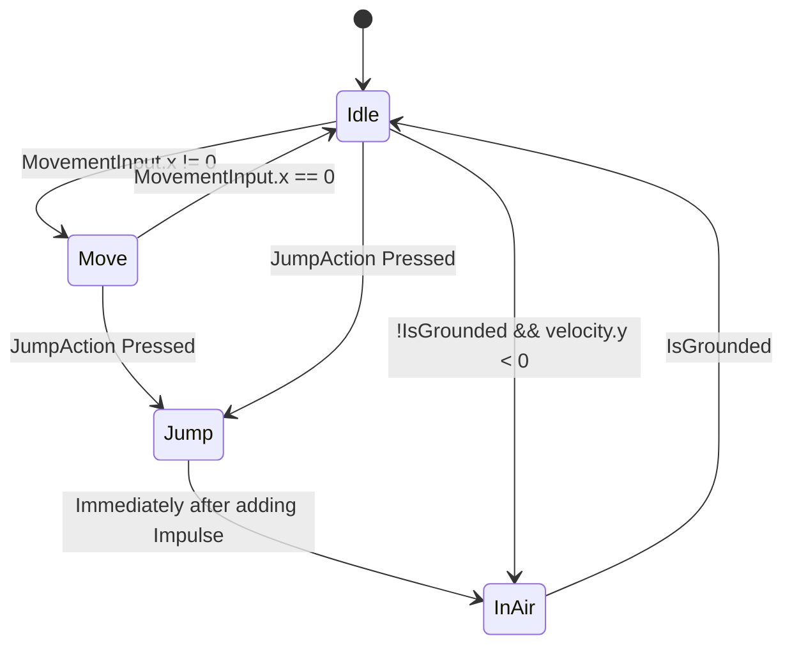

I'm ***BACK*** (from [[July 19th]]) and I'm trying to work some more.  I'd been thinking so much about abilities and things like that, but I was still so weirdly worried about implementing them. Now, I think I just want to go for it and see what sticks. It's courage time, baby! Let's see what we've got.

---

First things first, my workflow will be a little different for the next week or so, I've been housesitting by myself with my dog, working around his schedule mostly. It's been fun and has offered me some great focus time, but some of my work time has been cut out by my need to make food and take care of Max. He's pretty awesome!

In any case though, I have to see how I would implement something like my abilities. Specifically, I wanted to make a system for my different characters and things like that. Preferably, I'd have a \_\_\_-controller for each character from which I can call other component-like scripts and all that stuff...  But I don't know...

My main thing right now is some movement abilities I'd like to implement. The problem is, they would VERY LIKELY conflict with the PlayerController script that I already have, you know? Like, I can't have two scripts moving my GameObject (obviously), but I'm unsurprisingly trying to find the best way I'm aware of forwards.

That way that I see is possibly by implementing a State pattern for my PlayerController depending on the movement abilities. Essentially, I'd have my PlayerController class which would be my context, holding my input and the current state we're in. The current physics-based state that I've made in PlayerController (which needed revisiting and rewriting ANYWAY) would be implemented in the State and all that stuff.

For Achik, I have this ability in mind, a Spirit Form, where you can transform into a floating orb of spirit energy and can fly for a certain few seconds or for a certain distance. Time might work better for that. **The main thing though** is that this will control differently than the normal player, we won't obey gravity and will generally control uniquely. This seems to shout to me for a state-focused approach.

There's more utility in states for me though. I want to make sure it's performant and actually good, and I worry... But I ALWAYS worry, so I should proceed if I'm just going to worry about it either way. Let's do some refactoring then, shall we?

---

Looking at my PlayerController class, it certainly DOES control the player LOL. It comes off to me as one of those early monoliths in the making. I ask myself now, is this necessary? Could I just decouple some of the functions from this class as a Component (as I did elsewhere with my Interactable and Breakable tile classes)?

To that I proudly say yes. It may cost more data-wise, potentially, but I think the approach is worth it. Isn't that what OOP is all about? (nyuck nyuck nyuck!)

Seriously though, I think this might be useful and scalable approach. If other things can use the components, that'd be really nice! Not to mention, it sets a decent precedent that I have STANDARDS (and that matters to me).

Let's start this little surgery like so:

---

So in my PlayerController class currently, I can tell how many different ideas I have in one script (violating the SRP 🤓) simply by looking at how many InputActions I have in the script.

I have my FireAction there which can easily be decoupled in a seperate script...

I have my InteractAction which *may* deserve its own script but I'm not so sure. For now, let's keep it (we can always decouple it later like we're doing now).

I have my MoveAction and JumpAction which are going to stay as well. I'm secretely excited because this might help simplify the Animation work depending on how I do my states...

Time to map out the states. I wonder if I can do one of those Mermaid diagrams here!

There is a good question remaining, however... Will I still have my main context-contoller class handle all of the actions and group them up in one place? Or, do I have my other classes get the actions and all that stuff.
It's nice to have things all in one place, but it's no good to violate the SRP... That's really my main concern at present, is that my context class, which I'd probably still call PlayerController, is full of stuff like this. Sigh.
Hmm... I could make them generic or specific, which is sort of the problem I was encounering before. If I made an AchikController and a KowiController, they'd have to hook up to different scripts, since they have different states and all that jazz... They'd be different but they'd share some of the same states like The basic structure I implemented above...

However, we would be listening for different spells at different times... Which is a bit of a hassle. I might need to write individual states to handle the different abilities I might add. For MOVEMENT abilities this work. I think for TECHNIQUE abilities (non-MOVEMENT) abilities this works too.

Again, I COULD try for some generic slots for abilities, the main thing is listening for the inputs for them. That might be something I do in my OnInputAction functions...

---

So far, things are well. I've just decoupled the FireAction things into a new script called FireProjectile script. It is sufficient for NOW, but I want to at some point *see how I could fire DIFFERENT projectiles.* That might be something for a different state though, I'm not sure...

In any case, there are no new problems I notice in doing this so far. The script could use refactoring (and can far more easily receive it now that it's decoupled), but it's good for now :D.

What next...

Now, I think I want to actually try making my movement a state... I'm still a little unclear on how I want to implement states though... There are obviously some common ones like the movement-based states and all that, but I need to find out how I'll enter OTHER different states that are character-specific.

What I mean is, both Achik and Kowi can Move. That's a state they share. But if Kowi moves and holds a certain button or input (say the Interact button) for a certain period of time, she will be able to run. Should Achik's state script still LISTEN for that event?

The question is, *is it WORTH it* to implement a generic, shareable structure that avoids duplication and adheres to the good-boy standards I pride myself on? I think so (obviously, otherwise I'd be past this now).

***OR*** I remember something handy that prevents that. What if I was to create a special suite of OnInputHeld type functions or something that register after some period of holding the input? That's something that I can have in my PlayerController context class and INVOKE functions that match that in my states... Hrrnnng.... It's interesting because this input system supports all that.

Ok, so in the new input system that I'm using, there are Interactions which are recognizable patterns for some of these things (https://docs.unity3d.com/Packages/com.unity.inputsystem@1.0/manual/Interactions.html).

Goodness though, for now I need to go make some food, I'm really hungry. I'll be back in a little bit.

---

OK well I learned a LOT about the smoking point of olive oil lol. Won't be trying to make my potatoes that way with that cooking oil again. Suffice it to say that if there was a raging beehive they would've been placated in some of the smoke that I accidentally created. Luckily everything's fine and I didn't set off a fire alarm.

In any case, I can keep working for now, I suppose. Where did I leave off? Why, I was decoupling and pulling things away from my PlayerController class to make it as a state machine.

👁 I have seen the truth 👁 and it lies with using an abstract class to define my PlayerController. Then, from that, I can create an AchikController and KowiController maybe? One of the main sets of overrides that I would want is to their physics data, but I wonder if a ScriptableObject is better for that... We could have it and load from it in the context class...

I don't know about the abstract class after thinking more on it, it doesn't seem like I have enough to pass down that would really make use of polymorphism BESIDES the unique behaviors that we might check for in each class? AH, but I think about the unique states for different Movement and Technique abilities and that might be a decent use case... but how would I even define them, I wonder?

I definitely could do them as different component classes that are bound by some interface relating to how to start the technique or something like that. That's certainly possible, with the Interaction-determinant "slot" approach of starting the techniques in some way (ex: holding down an input, inputting a pattern, etc.).

OR I could do something where, in the component class for the ability, I could specify the InputAction that I listen for, responding to it in the class itself (which is kinda stupid sounding if I could just have it in the main context class that governs the state)...
Yeah a veto to that plan that wasn't any good I don't think. My idea was to get the InputAction, then maybe have an Inspector thing for the type of Interaction we want to activate it. But that might be better served in the main context class, I'll have to see.

So what I'm getting at so far is certainly turning my PlayerController right NOW into a context class with states and functions and things like that, maybe an abstract fella or interface called PlayerState that I can derive from. Then I might be able to get more specific with it somehow.

Either way let's try to get that context and a few initial states working.

I'll start with an abstract class, because EVERY TIME I usually try for an interface it ends up biting me because I need some preset functionality.

