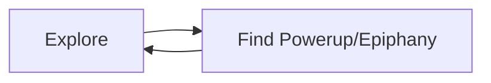

# Studying Gameplay - Lookin' at Loops
One of the most common pieces of feedback I have for myself is to refine the gameplay loop. Everybody always seems to say to make sure you know your gameplay loop like the back of your hand, and to make it as fun as possible.

I would guess initially that the gameplay loop of Metroidvania involves Exploration almost primarily. One of the main features of the genre involves exploring a versatile world map that opens up the more you get power-ups that allow you to traverse/ Explore more. To that end, and potentially quite reductively, I would chart it out like so:

^114fdd

It seems from some field research that it is this cycle of exploration and powerup discovery that leads to some meaningful progression. However, implementing this in a nonlinear fashion poses some initially-daunting problems. Some of the key Metroidvania titles have bosses in them, but I must study how they fit in - I'm trying to avoid the feeling of superimposing bosses in certain places that feels almost superficial or inorganic.

One of the terms I've been observing in my short study is the idea of "organic" obstacles. They say that when a powerup/epiphany occurs and the player character is upgraded, they should be able to overcome "organic" obstacles that previously blocked them. I think of the morph ball in Metroid, where an "organic" obstacle was the little 1-block high passage that Samus couldn't yet traverse.

---

### Level Design Helps Realize the Loop
This little Explore -> Epiphany loop can be most easily realized through the level design from how I see it now. This isn't to ignore the ways that the player characters will interact with the world; via abilities and all that. This is where I currently am with my design, in determining these things / interactions.

### Add onto this Loop by Fleshing Out Item Interactions!
One thing that I observe in some Metroidvanias, but mostly in Zelda, is a mix of interactions from one input. For example, you might use an item for its intended use to break blocks. Like an instrument with a special tune. However, you might also be able to play the tune to someone who may like it and give you an item, OR tame an animal or have other things happen like that. That would be cool.
	I just had an idea for Achik to play an instrument, probably the panflute or the quena or something that will have some effect. Maybe that's his projectile instead of the sun stuff, or maybe it's a tool to channel energy as well.

